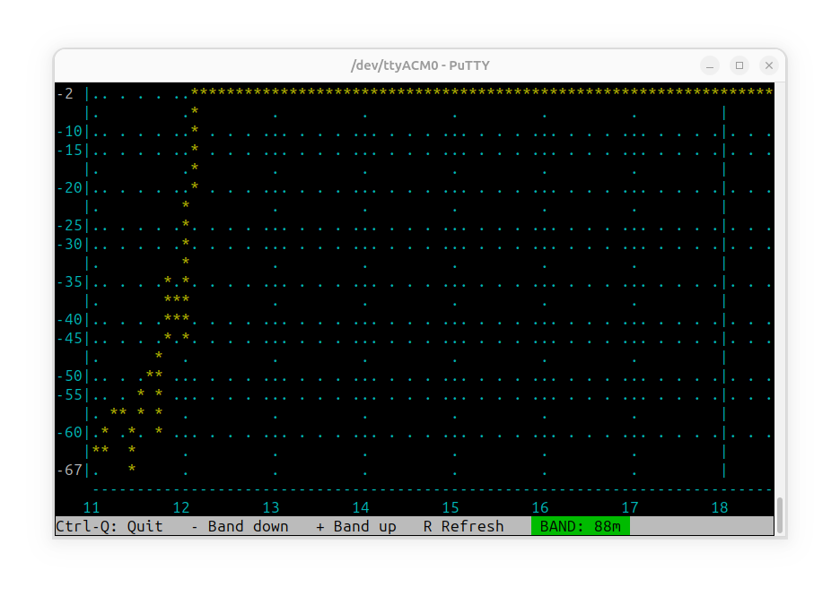
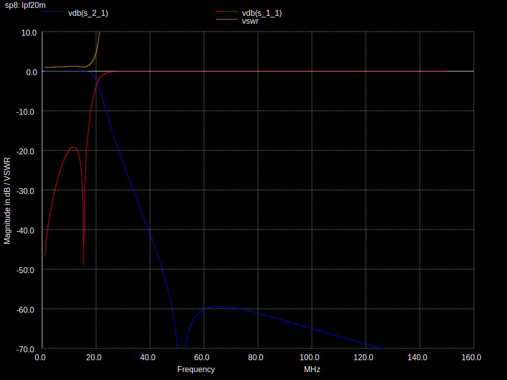
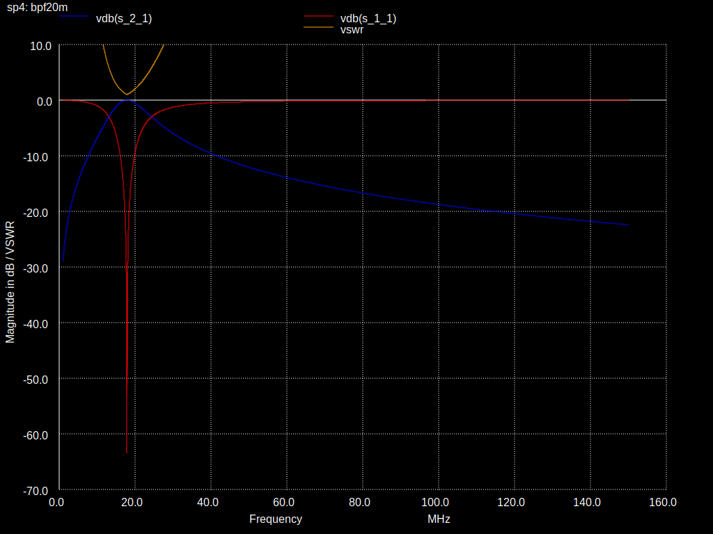

QMX filter studies
==================

## Introduction

I own a QMX+ and a QMX80-20m. Now I bought a QMX20-10m.
My idea is to shift the QMX20-10m filters one band upwards to get a QMX17-6m.
Will it work?

A very interesting feature is the ability of the QMX to sweep the BPFs/LPFs on its own.
When modifying the QMX, there are some challenges:
1. You can only measure the LPF and the BPF in combination.
2. We don't know the exact impedances and parasitic effects, so finding the correct parameters for simulations is difficult.
3. The Quadrature Sampling Detector / Tayloe Detector (Dan Tayloe, N7VE) has special properties.

Here I am documenting the results of my experiments (work in progress).

## Testing the built-in measurement capabilities

Before measuring my own filters, I am interested in the reliability of the built-in RF / LPF-sweep.
The first test is to connect the built-in signal generator directly to the input of the taylor detector using a cap of 1nF.
My expectation is, that the sweeps are sufficiently flat curves, so that testing the filters later does make sense.
Also some ripples can be tolerated.

### Output





### Conclusion
- Besides a minimum at 24MHz the sweeps are sufficiently flat (1-2 dB variation).
- Some frequency boundaries produce a bug resulting in extremely low values (<50dB)
- The built-in sweep function is sufficiently exact verify the function of the filters. 

## Simulations

Simulation of LPF and BPF filters of QMX (High-band) and QMX+ (6m) in NGSpice

ATTENTION: these simulations are too simplistic!

## Call
```
ngspice -b qmxfiltersim.cir
```

## Output
```
./out/bpf*m.svg: S11 + S21 + VSWR of bandpass
./out/lpf*m.svg: S11 + S21 + VSWR of lowpass
./out/lpfbpf*m.svg: S11 + S21 + VSWR of first lowpass(reverse) then bandpass (receive use case)
```

## Original LPF Configuration

| band      |   name |
|-----------|--------|
| 6m (QMX+) |  lpf6m |
| 10/11/12m | lpf10m |
| 15/17m    | lpf15m |
| 20m       | lpf20m |




## Original BPF Configuration




## Receiving through LPF(reverse) and BPF


## Notes
LC combinations of the BPF of QMX20-10
```
C403 30p  313.6nH  10m 
C401 33p  529.9n 
C404 33p  960.4n
C402 56p  1416.1n  20m
```