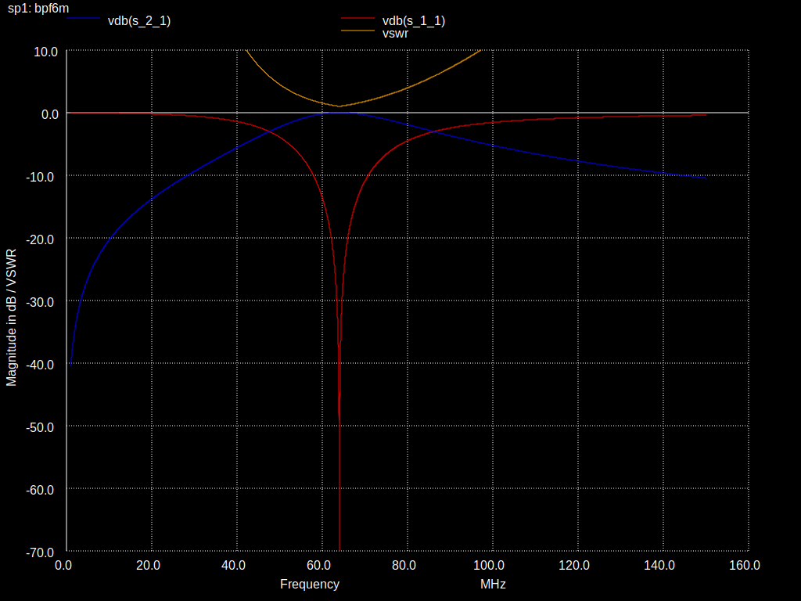
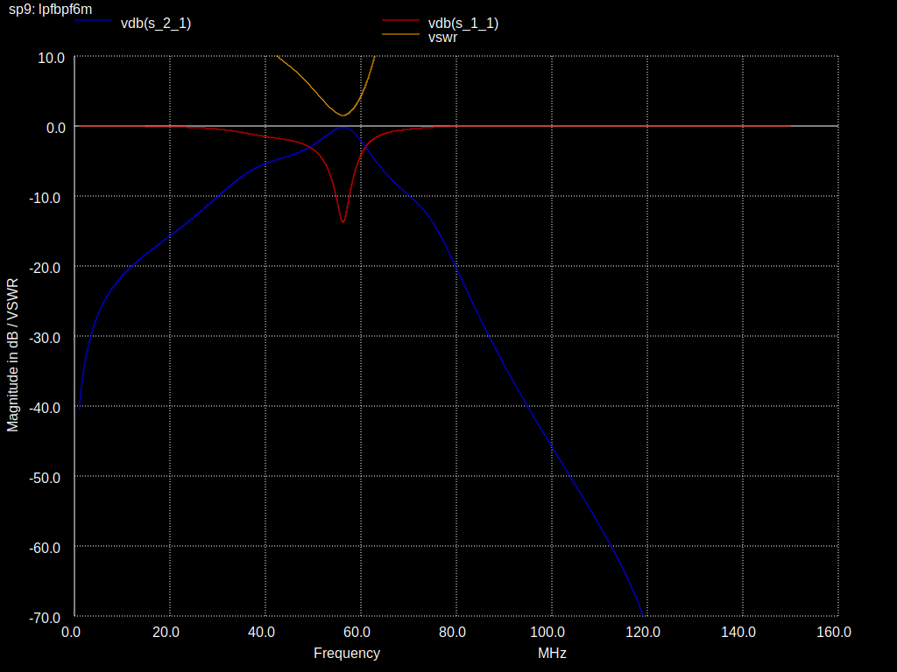

QMX filter simulation
=====================

Simulation of LPF and BPF filters of QMX (Highband) and QMX+ (6m) in NGSpice

## Call
```
ngspice -b qmxfiltersim.cir
```

## Output
```
./out/bpf*m.svg: S11 + S21 + VSWR of bandpass
./out/lpf*m.svg: S11 + S21 + VSWR of lowpass
./out/lpfbpf*m.svg: S11 + S21 + VSWR of first lowpass(reverse) then bandpass (receive use case)
```

## Images







## Notes
LC combinations of the BPF of QMX20-10
```
C403 30p  313.6nH  10m 
C401 33p  529.9n 
C404 33p  960.4n
C402 56p  1416.1n  20m
```