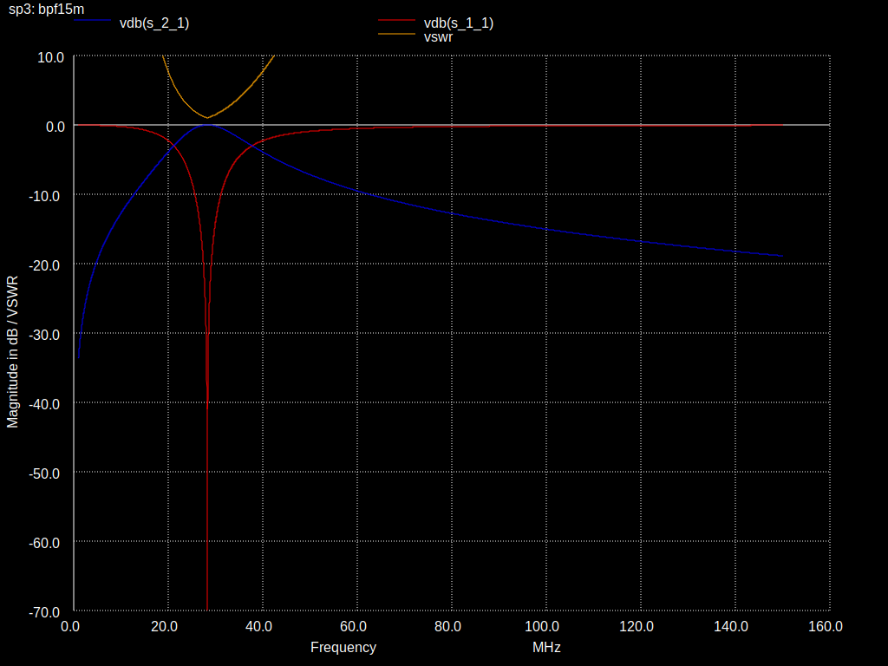
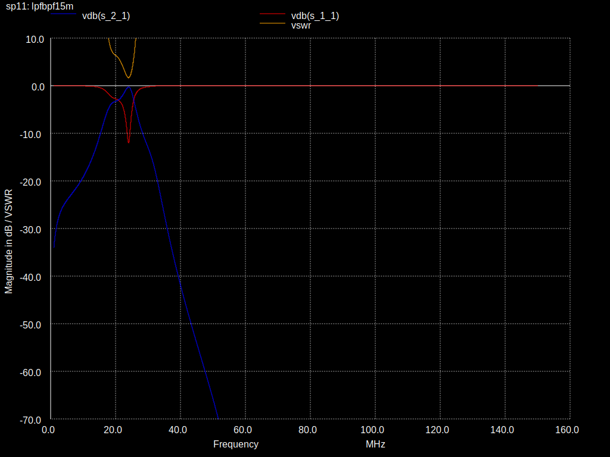
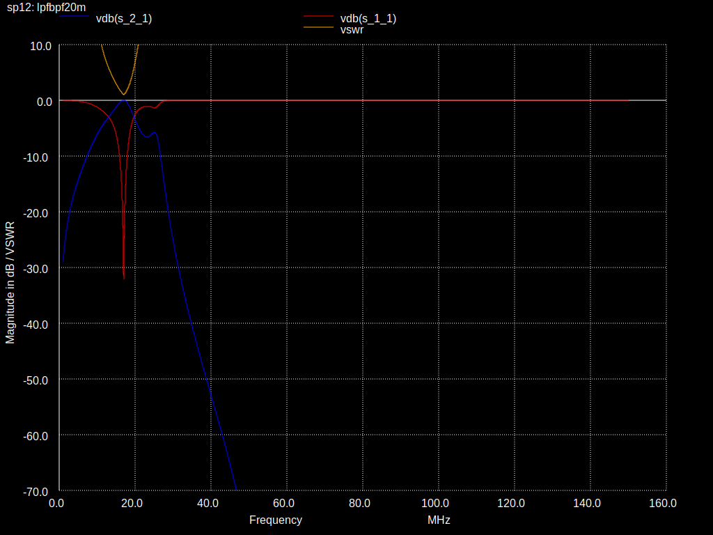

QMX filter simulation
=====================

Simulation of LPF and BPF filters of QMX (Highband) and QMX+ (6m) in NGSpice

## Call
```
ngspice -b qmxfiltersim.cir
```

## Output
```
./out/bpf*m.svg: S11 + S21 + VSWR of bandpass
./out/lpf*m.svg: S11 + S21 + VSWR of lowpass
./out/lpfbpf*m.svg: S11 + S21 + VSWR of first lowpass(reverse) then bandpass (receive use case)
```

## Original LPF Configuration

| band      |   name |
|-----------|--------|
| 6m (QMX+) |  lpf6m |
| 10/11/12m | lpf10m |
| 15/17m    | lpf15m |
| 20m       | lpf20m |


## Original BPF Configuration





## Receiving through LPF(reverse) and BPF






## Notes
LC combinations of the BPF of QMX20-10
```
C403 30p  313.6nH  10m 
C401 33p  529.9n 
C404 33p  960.4n
C402 56p  1416.1n  20m
```